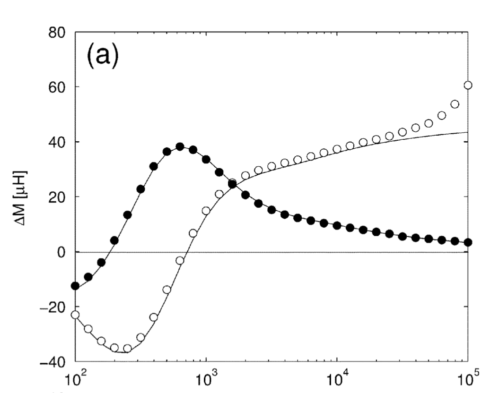

# Analytical Model for Tilted Coil (theo05)

Variacion de la Impedancia de una bobina sobre un conductor seminfinito para direfentes angulos de la bobina con respecto a la normal del conductor.

# Mutual impedance of coils in arbitrary position (theo07)

